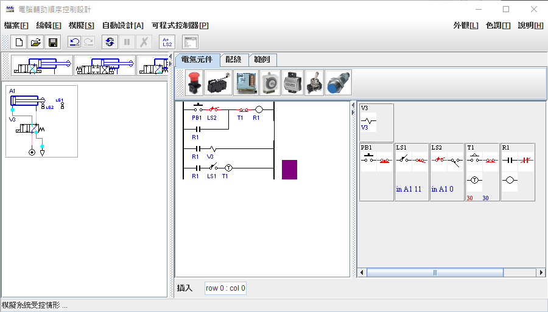

# Sequence Control Computer-Aided Design

SCCAD is a computer-aided sequence control design software.
The software is developed in Java and is an Eclipse project.

To start the program, use command:

java tw.com.justiot.sequencecontrol.SCCAD

This software allows user to design electric circuit (PLC program) for sequence control by

(1) setting up controlled system from a system pool,

(2) choosing electric devices,

(3) editting electric circuit for sequence control,

(4) simulating the control result of the circuit,

(5) translating the circuit design to programmable logic control programs of different models.

Reference:
1. [A Web-based, collaborative, computer-aided sequential control design tool, May 2003 IEEE control systems 23(2):14 - 19.](https://www.researchgate.net/publication/3207436_A_Web-based_collaborative_computer-aided_sequential_control_design_tool)
2. [Automatic Design of Electrical Circuits for Pneumatic Sequential Control, International Conference on Automation Technology (AUTOMATION 2003) At: National Chung Cheng University, Chia-Yi, Taiwan.](https://www.researchgate.net/publication/285582323_Automatic_Design_of_Electrical_Circuits_for_Pneumatic_Sequential_Control)
